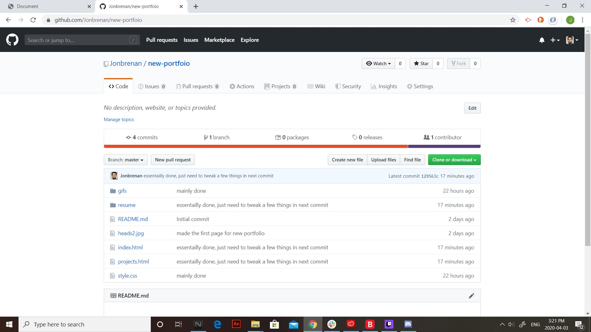
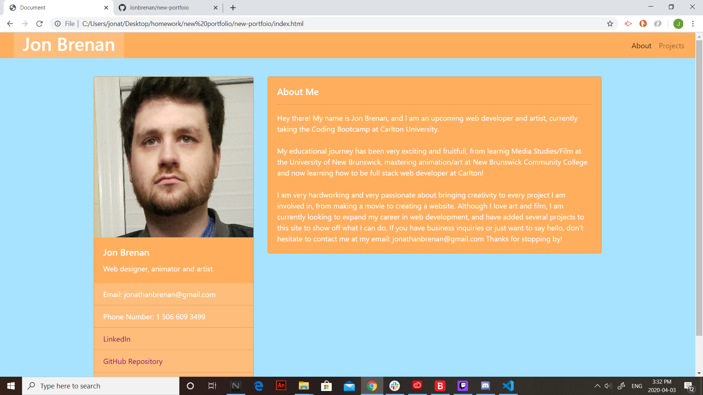

# New Portfolio
this is an updated version of my portfolio

This is an updated version of my portfolio that I will use to show off my coding projects to potential employers.

I attempted to create a basic layout that would effectivly inform those who visit my site about my contact information, LinkedIn, and GitHub profile.

I wrote a small "About Me" section to give people an impression of the kind of person and worker I am.

I did some extra work as well to make the site look more appealing, specifically the gifs I created on the project page. I thought
this would show employers that I have a sense of style and some extra skills to spice things up.

There weren't too many challanges with the assignment. The only real trouble I had was re-learning some of the basic properties about
Bootstrap and how to divide everything into rows and coloumns.

Installation

to install the application, one would go to the github link provoided in this README, download the link and run.
link: https://github.com/Jonbrenan/homework6

License

MIT License

Copyright (c) [year] [fullname]

Permission is hereby granted, free of charge, to any person obtaining a copy
of this software and associated documentation files (the "Software"), to deal
in the Software without restriction, including without limitation the rights
to use, copy, modify, merge, publish, distribute, sublicense, and/or sell
copies of the Software, and to permit persons to whom the Software is
furnished to do so, subject to the following conditions:

The above copyright notice and this permission notice shall be included in all
copies or substantial portions of the Software.

THE SOFTWARE IS PROVIDED "AS IS", WITHOUT WARRANTY OF ANY KIND, EXPRESS OR
IMPLIED, INCLUDING BUT NOT LIMITED TO THE WARRANTIES OF MERCHANTABILITY,
FITNESS FOR A PARTICULAR PURPOSE AND NONINFRINGEMENT. IN NO EVENT SHALL THE
AUTHORS OR COPYRIGHT HOLDERS BE LIABLE FOR ANY CLAIM, DAMAGES OR OTHER
LIABILITY, WHETHER IN AN ACTION OF CONTRACT, TORT OR OTHERWISE, ARISING FROM,
OUT OF OR IN CONNECTION WITH THE SOFTWARE OR THE USE OR OTHER DEALINGS IN THE
SOFTWARE.
